# R Base Plotting
MOHAMMAD SHADAN  
January 13, 2017  

To do any kind of plotting the first thing you need is data.    
R comes pre-loaded with some data sets for you to practise    

Now how would you know which all data sets you can access without loading it externally ?    


```r
data()
# install.packages("datasets")
# library(datasets)
```

I Will be using `mtcars` dataset.    
Load the dataset


```r
data(mtcars)
```

Summary Statistics

```r
dim(mtcars)      #dimension
```

```
## [1] 32 11
```

```r
str(mtcars)      #Internal STRucture
```

```
## 'data.frame':	32 obs. of  11 variables:
##  $ mpg : num  21 21 22.8 21.4 18.7 18.1 14.3 24.4 22.8 19.2 ...
##  $ cyl : num  6 6 4 6 8 6 8 4 4 6 ...
##  $ disp: num  160 160 108 258 360 ...
##  $ hp  : num  110 110 93 110 175 105 245 62 95 123 ...
##  $ drat: num  3.9 3.9 3.85 3.08 3.15 2.76 3.21 3.69 3.92 3.92 ...
##  $ wt  : num  2.62 2.88 2.32 3.21 3.44 ...
##  $ qsec: num  16.5 17 18.6 19.4 17 ...
##  $ vs  : num  0 0 1 1 0 1 0 1 1 1 ...
##  $ am  : num  1 1 1 0 0 0 0 0 0 0 ...
##  $ gear: num  4 4 4 3 3 3 3 4 4 4 ...
##  $ carb: num  4 4 1 1 2 1 4 2 2 4 ...
```

```r
summary(mtcars)  #Five Number Summary
```

```
##       mpg             cyl             disp             hp       
##  Min.   :10.40   Min.   :4.000   Min.   : 71.1   Min.   : 52.0  
##  1st Qu.:15.43   1st Qu.:4.000   1st Qu.:120.8   1st Qu.: 96.5  
##  Median :19.20   Median :6.000   Median :196.3   Median :123.0  
##  Mean   :20.09   Mean   :6.188   Mean   :230.7   Mean   :146.7  
##  3rd Qu.:22.80   3rd Qu.:8.000   3rd Qu.:326.0   3rd Qu.:180.0  
##  Max.   :33.90   Max.   :8.000   Max.   :472.0   Max.   :335.0  
##       drat             wt             qsec             vs        
##  Min.   :2.760   Min.   :1.513   Min.   :14.50   Min.   :0.0000  
##  1st Qu.:3.080   1st Qu.:2.581   1st Qu.:16.89   1st Qu.:0.0000  
##  Median :3.695   Median :3.325   Median :17.71   Median :0.0000  
##  Mean   :3.597   Mean   :3.217   Mean   :17.85   Mean   :0.4375  
##  3rd Qu.:3.920   3rd Qu.:3.610   3rd Qu.:18.90   3rd Qu.:1.0000  
##  Max.   :4.930   Max.   :5.424   Max.   :22.90   Max.   :1.0000  
##        am              gear            carb      
##  Min.   :0.0000   Min.   :3.000   Min.   :1.000  
##  1st Qu.:0.0000   1st Qu.:3.000   1st Qu.:2.000  
##  Median :0.0000   Median :4.000   Median :2.000  
##  Mean   :0.4062   Mean   :3.688   Mean   :2.812  
##  3rd Qu.:1.0000   3rd Qu.:4.000   3rd Qu.:4.000  
##  Max.   :1.0000   Max.   :5.000   Max.   :8.000
```

```r
names(mtcars)    #Column Names
```

```
##  [1] "mpg"  "cyl"  "disp" "hp"   "drat" "wt"   "qsec" "vs"   "am"   "gear"
## [11] "carb"
```

```r
rownames(mtcars) #Row Names
```

```
##  [1] "Mazda RX4"           "Mazda RX4 Wag"       "Datsun 710"         
##  [4] "Hornet 4 Drive"      "Hornet Sportabout"   "Valiant"            
##  [7] "Duster 360"          "Merc 240D"           "Merc 230"           
## [10] "Merc 280"            "Merc 280C"           "Merc 450SE"         
## [13] "Merc 450SL"          "Merc 450SLC"         "Cadillac Fleetwood" 
## [16] "Lincoln Continental" "Chrysler Imperial"   "Fiat 128"           
## [19] "Honda Civic"         "Toyota Corolla"      "Toyota Corona"      
## [22] "Dodge Challenger"    "AMC Javelin"         "Camaro Z28"         
## [25] "Pontiac Firebird"    "Fiat X1-9"           "Porsche 914-2"      
## [28] "Lotus Europa"        "Ford Pantera L"      "Ferrari Dino"       
## [31] "Maserati Bora"       "Volvo 142E"
```

```r
dimnames(mtcars) #Row and Column Names together
```

```
## [[1]]
##  [1] "Mazda RX4"           "Mazda RX4 Wag"       "Datsun 710"         
##  [4] "Hornet 4 Drive"      "Hornet Sportabout"   "Valiant"            
##  [7] "Duster 360"          "Merc 240D"           "Merc 230"           
## [10] "Merc 280"            "Merc 280C"           "Merc 450SE"         
## [13] "Merc 450SL"          "Merc 450SLC"         "Cadillac Fleetwood" 
## [16] "Lincoln Continental" "Chrysler Imperial"   "Fiat 128"           
## [19] "Honda Civic"         "Toyota Corolla"      "Toyota Corona"      
## [22] "Dodge Challenger"    "AMC Javelin"         "Camaro Z28"         
## [25] "Pontiac Firebird"    "Fiat X1-9"           "Porsche 914-2"      
## [28] "Lotus Europa"        "Ford Pantera L"      "Ferrari Dino"       
## [31] "Maserati Bora"       "Volvo 142E"         
## 
## [[2]]
##  [1] "mpg"  "cyl"  "disp" "hp"   "drat" "wt"   "qsec" "vs"   "am"   "gear"
## [11] "carb"
```

```r
head(mtcars)     #Top 6 entries
```

```
##                    mpg cyl disp  hp drat    wt  qsec vs am gear carb
## Mazda RX4         21.0   6  160 110 3.90 2.620 16.46  0  1    4    4
## Mazda RX4 Wag     21.0   6  160 110 3.90 2.875 17.02  0  1    4    4
## Datsun 710        22.8   4  108  93 3.85 2.320 18.61  1  1    4    1
## Hornet 4 Drive    21.4   6  258 110 3.08 3.215 19.44  1  0    3    1
## Hornet Sportabout 18.7   8  360 175 3.15 3.440 17.02  0  0    3    2
## Valiant           18.1   6  225 105 2.76 3.460 20.22  1  0    3    1
```

```r
tail(mtcars)     #Last 6 entries
```

```
##                 mpg cyl  disp  hp drat    wt qsec vs am gear carb
## Porsche 914-2  26.0   4 120.3  91 4.43 2.140 16.7  0  1    5    2
## Lotus Europa   30.4   4  95.1 113 3.77 1.513 16.9  1  1    5    2
## Ford Pantera L 15.8   8 351.0 264 4.22 3.170 14.5  0  1    5    4
## Ferrari Dino   19.7   6 145.0 175 3.62 2.770 15.5  0  1    5    6
## Maserati Bora  15.0   8 301.0 335 3.54 3.570 14.6  0  1    5    8
## Volvo 142E     21.4   4 121.0 109 4.11 2.780 18.6  1  1    4    2
```

Shortcuts

- Ctrl + Enter : Runs the current line
- Ctrl + L     : Clears the Console

###Base Plot   
1. Generic X-Y Plotting (Scatter, Line), plot()
2. Histogram, hist()
3. Barplot, barplot()
4. Boxplot, boxplot()

####Generic X-Y Plotting


```r
head(mtcars)
```

```
##                    mpg cyl disp  hp drat    wt  qsec vs am gear carb
## Mazda RX4         21.0   6  160 110 3.90 2.620 16.46  0  1    4    4
## Mazda RX4 Wag     21.0   6  160 110 3.90 2.875 17.02  0  1    4    4
## Datsun 710        22.8   4  108  93 3.85 2.320 18.61  1  1    4    1
## Hornet 4 Drive    21.4   6  258 110 3.08 3.215 19.44  1  0    3    1
## Hornet Sportabout 18.7   8  360 175 3.15 3.440 17.02  0  0    3    2
## Valiant           18.1   6  225 105 2.76 3.460 20.22  1  0    3    1
```

```r
plot(mtcars$wt)
```

<!-- -->

```r
plot(sort(mtcars$wt))
```

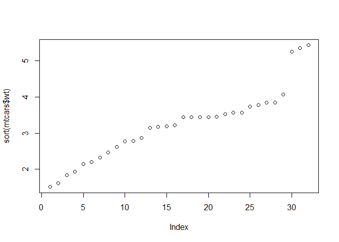<!-- -->

```r
plot(sort(mtcars$wt, decreasing = TRUE))
```

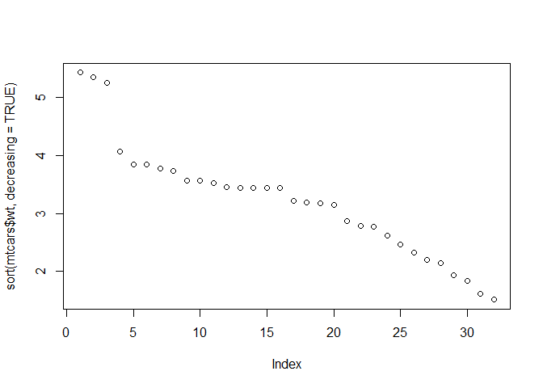<!-- -->

```r
# ?plot
# ?sort
plot(mtcars$wt)
```

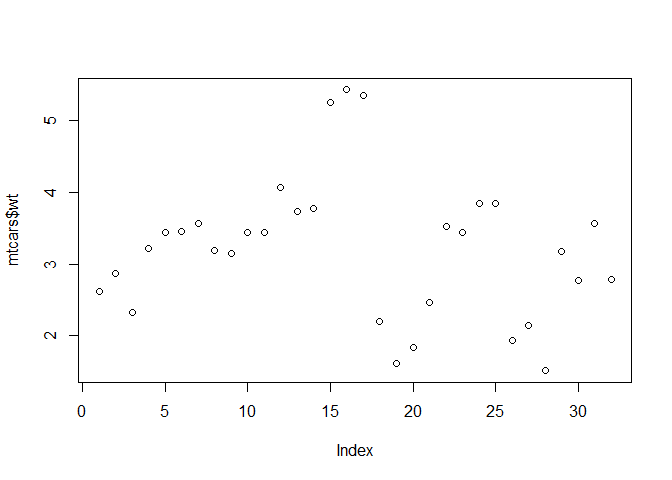<!-- -->

Different parameters in plot()

- `type` : type of plot (scatter or line etc.)

- `pch`: the plotting symbol (default is open circle)
- `cex`: controls the symbol size in the plot, default is cex=1

- `lty`: the line type (default is solid line), can be dashed, dotted, etc.
- `lwd`: the line width, specified as an integer multiple. lwd=1 is default and 2 is twice as wide.

- `col`: the plotting color, specified as a number, string, or hex code; the colors() function gives  you a vector of colors by name

- `xlab`: character string for the x-axis label
- `ylab`: character string for the y-axis label
- `main`: character string for the main label (overall title for the plot)
- `sub` : a sub title for the plot

First parameter we look into is "type="    

- `p`	    points
- `l`	    lines
- `o`    overplotted points and lines
- `b,c` 	  points (empty if "c") joined by lines
- `s,S` 	  stair steps
- `h`	    histogram-like vertical lines
- `n`	    does not produce any points or lines


```r
plot(mtcars$wt, type="p")     # points (default)
```

<!-- -->

```r
plot(mtcars$wt, type="l")     # lines
```

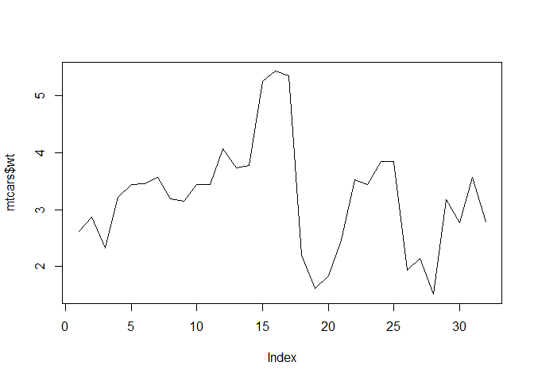<!-- -->

```r
plot(mtcars$wt, type="o")     # points and lines together
```

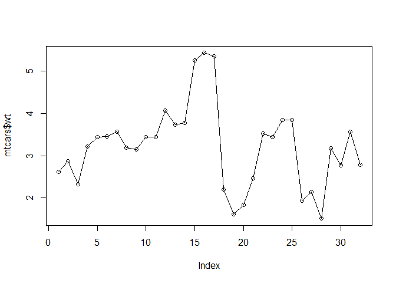<!-- -->

```r
plot(mtcars$wt, type="b")     # for both points and lines
```

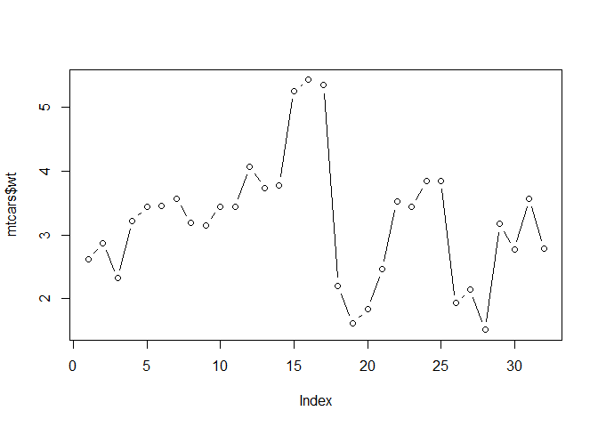<!-- -->

```r
plot(mtcars$wt, type="c")     # for the lines part alone of "b",
```

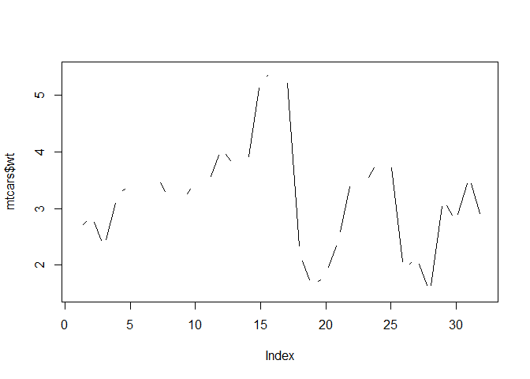<!-- -->

```r
plot(mtcars$wt, type="s")     # stair steps
```

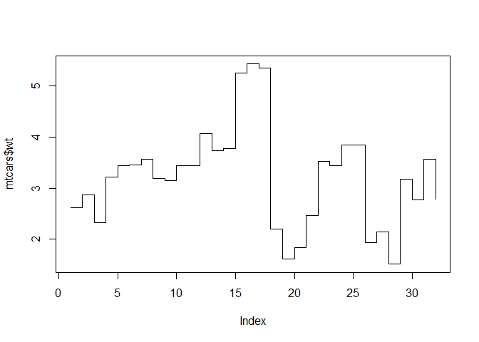<!-- -->

```r
plot(mtcars$wt, type="S")     # stair steps
```

<!-- -->

```r
plot(mtcars$wt, type="h")     # histogram like vertical lines
```

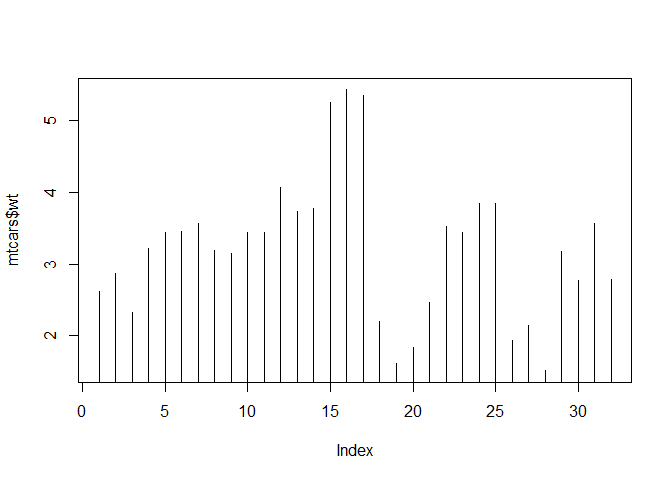<!-- -->

```r
plot(mtcars$wt, type="n")     # does not produce any points (???)
```

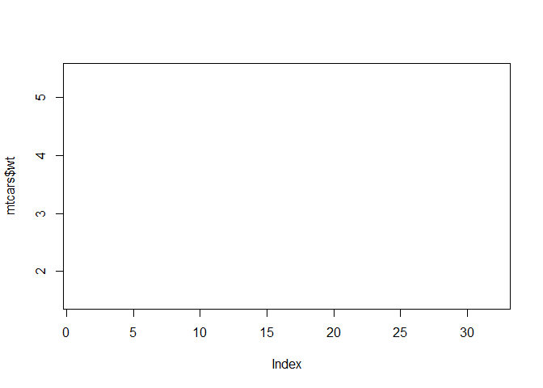<!-- -->

Parameter pch and cex. This is for points i.e. default or type="p"

```r
plot(mtcars$wt)
```

<!-- -->

```r
plot(mtcars$wt, type="p", pch=1, cex=1)     # default
```

<!-- -->

```r
plot(mtcars$wt, type="p", pch=2, cex=1) 
```

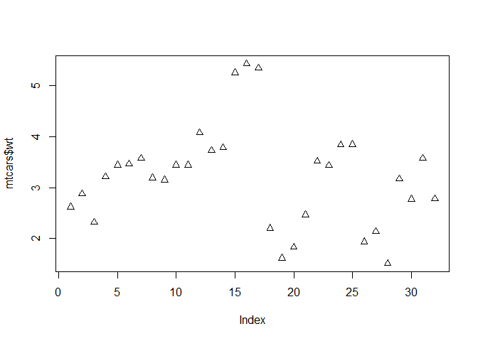<!-- -->

```r
plot(mtcars$wt, type="p", pch=2, cex=2) 
```

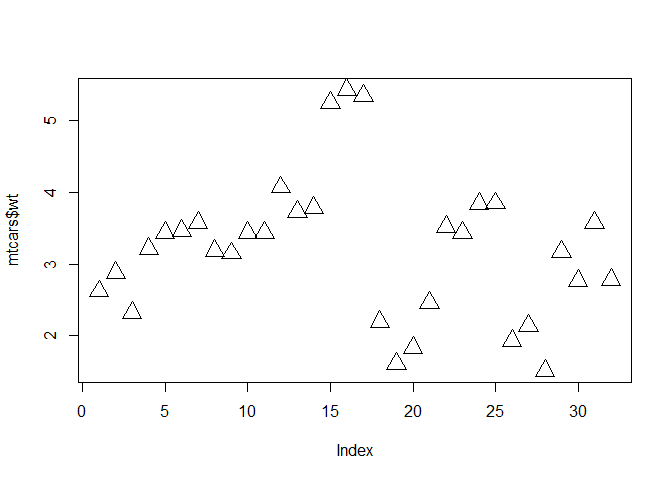<!-- -->

```r
plot(mtcars$wt, type="p", pch=18, cex=3) 
```

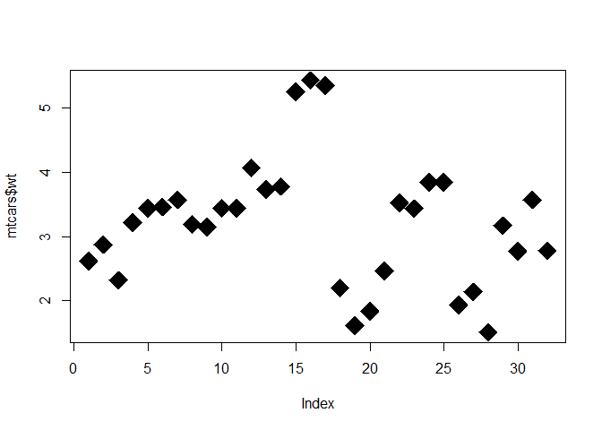<!-- -->

```r
plot(mtcars$wt, type="p", pch=18, cex=3, col="red")
```

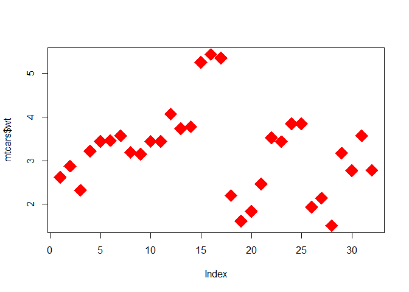<!-- -->

```r
plot(mtcars$wt, type="p", pch=18, cex=3, col="blue")
```

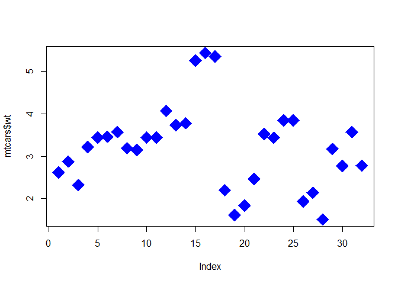<!-- -->

[Colors](http://www.stat.columbia.edu/~tzheng/files/Rcolor.pdf)

Parameter lty and lwd. This is for points i.e. default or type="p"

```r
plot(mtcars$wt, type="l")
```

<!-- -->

```r
plot(mtcars$wt, type="l", lty=1, lwd=1)     # points
```

<!-- -->

```r
plot(mtcars$wt, type="l", lty=2, lwd=3)     # points
```

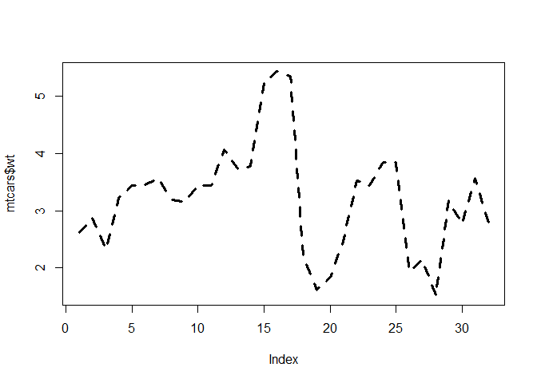<!-- -->

```r
plot(mtcars$wt, type="l", lty=3, lwd=3)
```

<!-- -->

```r
colors()
```

```
##   [1] "white"                "aliceblue"            "antiquewhite"        
##   [4] "antiquewhite1"        "antiquewhite2"        "antiquewhite3"       
##   [7] "antiquewhite4"        "aquamarine"           "aquamarine1"         
##  [10] "aquamarine2"          "aquamarine3"          "aquamarine4"         
##  [13] "azure"                "azure1"               "azure2"              
##  [16] "azure3"               "azure4"               "beige"               
##  [19] "bisque"               "bisque1"              "bisque2"             
##  [22] "bisque3"              "bisque4"              "black"               
##  [25] "blanchedalmond"       "blue"                 "blue1"               
##  [28] "blue2"                "blue3"                "blue4"               
##  [31] "blueviolet"           "brown"                "brown1"              
##  [34] "brown2"               "brown3"               "brown4"              
##  [37] "burlywood"            "burlywood1"           "burlywood2"          
##  [40] "burlywood3"           "burlywood4"           "cadetblue"           
##  [43] "cadetblue1"           "cadetblue2"           "cadetblue3"          
##  [46] "cadetblue4"           "chartreuse"           "chartreuse1"         
##  [49] "chartreuse2"          "chartreuse3"          "chartreuse4"         
##  [52] "chocolate"            "chocolate1"           "chocolate2"          
##  [55] "chocolate3"           "chocolate4"           "coral"               
##  [58] "coral1"               "coral2"               "coral3"              
##  [61] "coral4"               "cornflowerblue"       "cornsilk"            
##  [64] "cornsilk1"            "cornsilk2"            "cornsilk3"           
##  [67] "cornsilk4"            "cyan"                 "cyan1"               
##  [70] "cyan2"                "cyan3"                "cyan4"               
##  [73] "darkblue"             "darkcyan"             "darkgoldenrod"       
##  [76] "darkgoldenrod1"       "darkgoldenrod2"       "darkgoldenrod3"      
##  [79] "darkgoldenrod4"       "darkgray"             "darkgreen"           
##  [82] "darkgrey"             "darkkhaki"            "darkmagenta"         
##  [85] "darkolivegreen"       "darkolivegreen1"      "darkolivegreen2"     
##  [88] "darkolivegreen3"      "darkolivegreen4"      "darkorange"          
##  [91] "darkorange1"          "darkorange2"          "darkorange3"         
##  [94] "darkorange4"          "darkorchid"           "darkorchid1"         
##  [97] "darkorchid2"          "darkorchid3"          "darkorchid4"         
## [100] "darkred"              "darksalmon"           "darkseagreen"        
## [103] "darkseagreen1"        "darkseagreen2"        "darkseagreen3"       
## [106] "darkseagreen4"        "darkslateblue"        "darkslategray"       
## [109] "darkslategray1"       "darkslategray2"       "darkslategray3"      
## [112] "darkslategray4"       "darkslategrey"        "darkturquoise"       
## [115] "darkviolet"           "deeppink"             "deeppink1"           
## [118] "deeppink2"            "deeppink3"            "deeppink4"           
## [121] "deepskyblue"          "deepskyblue1"         "deepskyblue2"        
## [124] "deepskyblue3"         "deepskyblue4"         "dimgray"             
## [127] "dimgrey"              "dodgerblue"           "dodgerblue1"         
## [130] "dodgerblue2"          "dodgerblue3"          "dodgerblue4"         
## [133] "firebrick"            "firebrick1"           "firebrick2"          
## [136] "firebrick3"           "firebrick4"           "floralwhite"         
## [139] "forestgreen"          "gainsboro"            "ghostwhite"          
## [142] "gold"                 "gold1"                "gold2"               
## [145] "gold3"                "gold4"                "goldenrod"           
## [148] "goldenrod1"           "goldenrod2"           "goldenrod3"          
## [151] "goldenrod4"           "gray"                 "gray0"               
## [154] "gray1"                "gray2"                "gray3"               
## [157] "gray4"                "gray5"                "gray6"               
## [160] "gray7"                "gray8"                "gray9"               
## [163] "gray10"               "gray11"               "gray12"              
## [166] "gray13"               "gray14"               "gray15"              
## [169] "gray16"               "gray17"               "gray18"              
## [172] "gray19"               "gray20"               "gray21"              
## [175] "gray22"               "gray23"               "gray24"              
## [178] "gray25"               "gray26"               "gray27"              
## [181] "gray28"               "gray29"               "gray30"              
## [184] "gray31"               "gray32"               "gray33"              
## [187] "gray34"               "gray35"               "gray36"              
## [190] "gray37"               "gray38"               "gray39"              
## [193] "gray40"               "gray41"               "gray42"              
## [196] "gray43"               "gray44"               "gray45"              
## [199] "gray46"               "gray47"               "gray48"              
## [202] "gray49"               "gray50"               "gray51"              
## [205] "gray52"               "gray53"               "gray54"              
## [208] "gray55"               "gray56"               "gray57"              
## [211] "gray58"               "gray59"               "gray60"              
## [214] "gray61"               "gray62"               "gray63"              
## [217] "gray64"               "gray65"               "gray66"              
## [220] "gray67"               "gray68"               "gray69"              
## [223] "gray70"               "gray71"               "gray72"              
## [226] "gray73"               "gray74"               "gray75"              
## [229] "gray76"               "gray77"               "gray78"              
## [232] "gray79"               "gray80"               "gray81"              
## [235] "gray82"               "gray83"               "gray84"              
## [238] "gray85"               "gray86"               "gray87"              
## [241] "gray88"               "gray89"               "gray90"              
## [244] "gray91"               "gray92"               "gray93"              
## [247] "gray94"               "gray95"               "gray96"              
## [250] "gray97"               "gray98"               "gray99"              
## [253] "gray100"              "green"                "green1"              
## [256] "green2"               "green3"               "green4"              
## [259] "greenyellow"          "grey"                 "grey0"               
## [262] "grey1"                "grey2"                "grey3"               
## [265] "grey4"                "grey5"                "grey6"               
## [268] "grey7"                "grey8"                "grey9"               
## [271] "grey10"               "grey11"               "grey12"              
## [274] "grey13"               "grey14"               "grey15"              
## [277] "grey16"               "grey17"               "grey18"              
## [280] "grey19"               "grey20"               "grey21"              
## [283] "grey22"               "grey23"               "grey24"              
## [286] "grey25"               "grey26"               "grey27"              
## [289] "grey28"               "grey29"               "grey30"              
## [292] "grey31"               "grey32"               "grey33"              
## [295] "grey34"               "grey35"               "grey36"              
## [298] "grey37"               "grey38"               "grey39"              
## [301] "grey40"               "grey41"               "grey42"              
## [304] "grey43"               "grey44"               "grey45"              
## [307] "grey46"               "grey47"               "grey48"              
## [310] "grey49"               "grey50"               "grey51"              
## [313] "grey52"               "grey53"               "grey54"              
## [316] "grey55"               "grey56"               "grey57"              
## [319] "grey58"               "grey59"               "grey60"              
## [322] "grey61"               "grey62"               "grey63"              
## [325] "grey64"               "grey65"               "grey66"              
## [328] "grey67"               "grey68"               "grey69"              
## [331] "grey70"               "grey71"               "grey72"              
## [334] "grey73"               "grey74"               "grey75"              
## [337] "grey76"               "grey77"               "grey78"              
## [340] "grey79"               "grey80"               "grey81"              
## [343] "grey82"               "grey83"               "grey84"              
## [346] "grey85"               "grey86"               "grey87"              
## [349] "grey88"               "grey89"               "grey90"              
## [352] "grey91"               "grey92"               "grey93"              
## [355] "grey94"               "grey95"               "grey96"              
## [358] "grey97"               "grey98"               "grey99"              
## [361] "grey100"              "honeydew"             "honeydew1"           
## [364] "honeydew2"            "honeydew3"            "honeydew4"           
## [367] "hotpink"              "hotpink1"             "hotpink2"            
## [370] "hotpink3"             "hotpink4"             "indianred"           
## [373] "indianred1"           "indianred2"           "indianred3"          
## [376] "indianred4"           "ivory"                "ivory1"              
## [379] "ivory2"               "ivory3"               "ivory4"              
## [382] "khaki"                "khaki1"               "khaki2"              
## [385] "khaki3"               "khaki4"               "lavender"            
## [388] "lavenderblush"        "lavenderblush1"       "lavenderblush2"      
## [391] "lavenderblush3"       "lavenderblush4"       "lawngreen"           
## [394] "lemonchiffon"         "lemonchiffon1"        "lemonchiffon2"       
## [397] "lemonchiffon3"        "lemonchiffon4"        "lightblue"           
## [400] "lightblue1"           "lightblue2"           "lightblue3"          
## [403] "lightblue4"           "lightcoral"           "lightcyan"           
## [406] "lightcyan1"           "lightcyan2"           "lightcyan3"          
## [409] "lightcyan4"           "lightgoldenrod"       "lightgoldenrod1"     
## [412] "lightgoldenrod2"      "lightgoldenrod3"      "lightgoldenrod4"     
## [415] "lightgoldenrodyellow" "lightgray"            "lightgreen"          
## [418] "lightgrey"            "lightpink"            "lightpink1"          
## [421] "lightpink2"           "lightpink3"           "lightpink4"          
## [424] "lightsalmon"          "lightsalmon1"         "lightsalmon2"        
## [427] "lightsalmon3"         "lightsalmon4"         "lightseagreen"       
## [430] "lightskyblue"         "lightskyblue1"        "lightskyblue2"       
## [433] "lightskyblue3"        "lightskyblue4"        "lightslateblue"      
## [436] "lightslategray"       "lightslategrey"       "lightsteelblue"      
## [439] "lightsteelblue1"      "lightsteelblue2"      "lightsteelblue3"     
## [442] "lightsteelblue4"      "lightyellow"          "lightyellow1"        
## [445] "lightyellow2"         "lightyellow3"         "lightyellow4"        
## [448] "limegreen"            "linen"                "magenta"             
## [451] "magenta1"             "magenta2"             "magenta3"            
## [454] "magenta4"             "maroon"               "maroon1"             
## [457] "maroon2"              "maroon3"              "maroon4"             
## [460] "mediumaquamarine"     "mediumblue"           "mediumorchid"        
## [463] "mediumorchid1"        "mediumorchid2"        "mediumorchid3"       
## [466] "mediumorchid4"        "mediumpurple"         "mediumpurple1"       
## [469] "mediumpurple2"        "mediumpurple3"        "mediumpurple4"       
## [472] "mediumseagreen"       "mediumslateblue"      "mediumspringgreen"   
## [475] "mediumturquoise"      "mediumvioletred"      "midnightblue"        
## [478] "mintcream"            "mistyrose"            "mistyrose1"          
## [481] "mistyrose2"           "mistyrose3"           "mistyrose4"          
## [484] "moccasin"             "navajowhite"          "navajowhite1"        
## [487] "navajowhite2"         "navajowhite3"         "navajowhite4"        
## [490] "navy"                 "navyblue"             "oldlace"             
## [493] "olivedrab"            "olivedrab1"           "olivedrab2"          
## [496] "olivedrab3"           "olivedrab4"           "orange"              
## [499] "orange1"              "orange2"              "orange3"             
## [502] "orange4"              "orangered"            "orangered1"          
## [505] "orangered2"           "orangered3"           "orangered4"          
## [508] "orchid"               "orchid1"              "orchid2"             
## [511] "orchid3"              "orchid4"              "palegoldenrod"       
## [514] "palegreen"            "palegreen1"           "palegreen2"          
## [517] "palegreen3"           "palegreen4"           "paleturquoise"       
## [520] "paleturquoise1"       "paleturquoise2"       "paleturquoise3"      
## [523] "paleturquoise4"       "palevioletred"        "palevioletred1"      
## [526] "palevioletred2"       "palevioletred3"       "palevioletred4"      
## [529] "papayawhip"           "peachpuff"            "peachpuff1"          
## [532] "peachpuff2"           "peachpuff3"           "peachpuff4"          
## [535] "peru"                 "pink"                 "pink1"               
## [538] "pink2"                "pink3"                "pink4"               
## [541] "plum"                 "plum1"                "plum2"               
## [544] "plum3"                "plum4"                "powderblue"          
## [547] "purple"               "purple1"              "purple2"             
## [550] "purple3"              "purple4"              "red"                 
## [553] "red1"                 "red2"                 "red3"                
## [556] "red4"                 "rosybrown"            "rosybrown1"          
## [559] "rosybrown2"           "rosybrown3"           "rosybrown4"          
## [562] "royalblue"            "royalblue1"           "royalblue2"          
## [565] "royalblue3"           "royalblue4"           "saddlebrown"         
## [568] "salmon"               "salmon1"              "salmon2"             
## [571] "salmon3"              "salmon4"              "sandybrown"          
## [574] "seagreen"             "seagreen1"            "seagreen2"           
## [577] "seagreen3"            "seagreen4"            "seashell"            
## [580] "seashell1"            "seashell2"            "seashell3"           
## [583] "seashell4"            "sienna"               "sienna1"             
## [586] "sienna2"              "sienna3"              "sienna4"             
## [589] "skyblue"              "skyblue1"             "skyblue2"            
## [592] "skyblue3"             "skyblue4"             "slateblue"           
## [595] "slateblue1"           "slateblue2"           "slateblue3"          
## [598] "slateblue4"           "slategray"            "slategray1"          
## [601] "slategray2"           "slategray3"           "slategray4"          
## [604] "slategrey"            "snow"                 "snow1"               
## [607] "snow2"                "snow3"                "snow4"               
## [610] "springgreen"          "springgreen1"         "springgreen2"        
## [613] "springgreen3"         "springgreen4"         "steelblue"           
## [616] "steelblue1"           "steelblue2"           "steelblue3"          
## [619] "steelblue4"           "tan"                  "tan1"                
## [622] "tan2"                 "tan3"                 "tan4"                
## [625] "thistle"              "thistle1"             "thistle2"            
## [628] "thistle3"             "thistle4"             "tomato"              
## [631] "tomato1"              "tomato2"              "tomato3"             
## [634] "tomato4"              "turquoise"            "turquoise1"          
## [637] "turquoise2"           "turquoise3"           "turquoise4"          
## [640] "violet"               "violetred"            "violetred1"          
## [643] "violetred2"           "violetred3"           "violetred4"          
## [646] "wheat"                "wheat1"               "wheat2"              
## [649] "wheat3"               "wheat4"               "whitesmoke"          
## [652] "yellow"               "yellow1"              "yellow2"             
## [655] "yellow3"              "yellow4"              "yellowgreen"
```
[Line Type](http://www.statmethods.net/advgraphs/parameters.html)

###Parameters xlab, ylab, main


```r
#Default Values

plot(mtcars$wt)
```

<!-- -->

```r
plot(mtcars$wt,
     type="p", #points
     pch=1,    #point shape
     cex=1,    #point size
     lty=1,    #line type
     lwd=1,    #line width
     xlab = "Weight",
     ylab = "Weight Index",
     main = "Distribution of Car Weight")
```

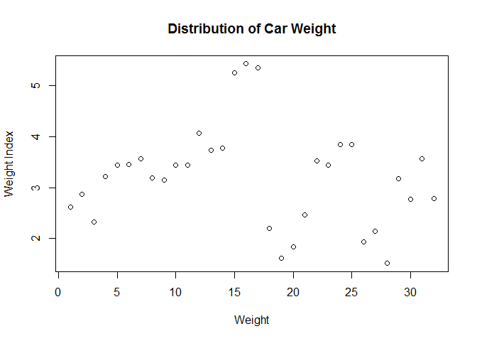<!-- -->

```r
     # sub = "Sub Title")
```


```r
plot(mtcars$wt,
     type="o", #points
     pch=18,    #point shape
     cex=2,    #point size
     lty=5,    #line type
     lwd=2,    #line width
     col="red",
     xlab = "Weight",
     ylab = "Weight Index",
     main = "Distribution of Car Weight",
     sub = "Sub Title")
```

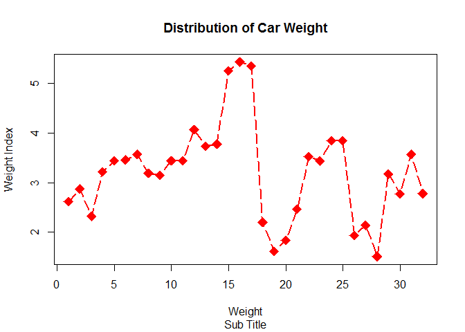<!-- -->
####Scatter Plot with two variables

```r
plot(x=mtcars$wt, y=mtcars$mpg)
```

<!-- -->
