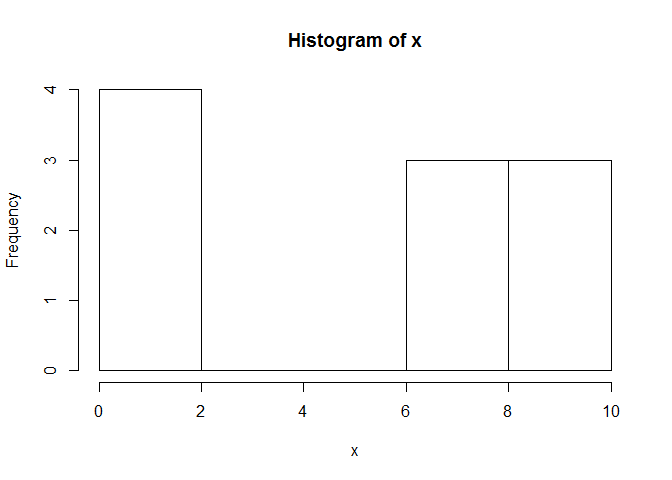
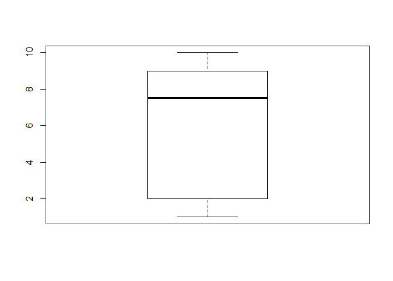

# R - Mean, Median, Mode
MOHAMMAD SHADAN  
January 16, 2017  


### Measures of Central Tendency

1. Mean   : Average   
2. Median : Middle Value   
3. Mode   : Most Often    


```r
x <- c(8,2,7,1,2,9,8,2,10,9)

#Exploratory Data Analysis
hist(x)
```

<!-- -->

```r
boxplot(x)
```

<!-- -->

####Mean : The mean is the average of the numbers

```r
sum(x)/length(x)
```

```
## [1] 5.8
```

```r
#?mean
#Function in base R
mean(x)
```

```
## [1] 5.8
```

####Median : the middle number given the numbers are in order (sorted)

```r
sort(x)
```

```
##  [1]  1  2  2  2  7  8  8  9  9 10
```

```r
#?median
median(x)
```

```
## [1] 7.5
```

####Mode : The number which appears most often in a set of numbers

```r
#There is no function in base R to find mode of set of numbers
x <- c(8,2,7,1,2,9,8,2,10,9)

#Function to find Mode
x
```

```
##  [1]  8  2  7  1  2  9  8  2 10  9
```

```r
#?table
y <- table(x)
y
```

```
## x
##  1  2  7  8  9 10 
##  1  3  1  2  2  1
```

```r
names(y)[which(y==max(y))]
```

```
## [1] "2"
```

```r
#or in single line
names(table(x))[table(x)==max(table(x))]
```

```
## [1] "2"
```

```r
#Testing if there are two or more numbers with same frequncy
x <- c(8,2,7,1,2,9,8,2,10,9,8)
sort(x)
```

```
##  [1]  1  2  2  2  7  8  8  8  9  9 10
```

```r
#Mode
names(table(x))[table(x)==max(table(x))]
```

```
## [1] "2" "8"
```

###Mean, Median and Mode using `mtcars` dataset


```r
head(mtcars)
```

```
##                    mpg cyl disp  hp drat    wt  qsec vs am gear carb
## Mazda RX4         21.0   6  160 110 3.90 2.620 16.46  0  1    4    4
## Mazda RX4 Wag     21.0   6  160 110 3.90 2.875 17.02  0  1    4    4
## Datsun 710        22.8   4  108  93 3.85 2.320 18.61  1  1    4    1
## Hornet 4 Drive    21.4   6  258 110 3.08 3.215 19.44  1  0    3    1
## Hornet Sportabout 18.7   8  360 175 3.15 3.440 17.02  0  0    3    2
## Valiant           18.1   6  225 105 2.76 3.460 20.22  1  0    3    1
```

```r
x <- mtcars$wt
```

#### Mean

```r
mean(x)
```

```
## [1] 3.21725
```

#### Median

```r
median(x)
```

```
## [1] 3.325
```

####Mode

```r
y <- table(x)
y
```

```
## x
## 1.513 1.615 1.835 1.935  2.14   2.2  2.32 2.465  2.62  2.77  2.78 2.875 
##     1     1     1     1     1     1     1     1     1     1     1     1 
##  3.15  3.17  3.19 3.215 3.435  3.44  3.46  3.52  3.57  3.73  3.78  3.84 
##     1     1     1     1     1     3     1     1     2     1     1     1 
## 3.845  4.07  5.25 5.345 5.424 
##     1     1     1     1     1
```

```r
names(y)[which(y==max(y))]
```

```
## [1] "3.44"
```

```r
#or
names(table(x))[table(x)==max(table(x))]
```

```
## [1] "3.44"
```

####Mean, Median and Mode using `airquality` dataset  

I am using `airquality` dataset because it has missing values


```r
#Summary Statistics
dim(airquality)
```

```
## [1] 153   6
```

```r
names(airquality)
```

```
## [1] "Ozone"   "Solar.R" "Wind"    "Temp"    "Month"   "Day"
```

```r
str(airquality)
```

```
## 'data.frame':	153 obs. of  6 variables:
##  $ Ozone  : int  41 36 12 18 NA 28 23 19 8 NA ...
##  $ Solar.R: int  190 118 149 313 NA NA 299 99 19 194 ...
##  $ Wind   : num  7.4 8 12.6 11.5 14.3 14.9 8.6 13.8 20.1 8.6 ...
##  $ Temp   : int  67 72 74 62 56 66 65 59 61 69 ...
##  $ Month  : int  5 5 5 5 5 5 5 5 5 5 ...
##  $ Day    : int  1 2 3 4 5 6 7 8 9 10 ...
```

```r
head(airquality)
```

```
##   Ozone Solar.R Wind Temp Month Day
## 1    41     190  7.4   67     5   1
## 2    36     118  8.0   72     5   2
## 3    12     149 12.6   74     5   3
## 4    18     313 11.5   62     5   4
## 5    NA      NA 14.3   56     5   5
## 6    28      NA 14.9   66     5   6
```

```r
#Column names with missing Values
names(airquality)[colSums(is.na(airquality)) > 0]
```

```
## [1] "Ozone"   "Solar.R"
```

```r
airquality$Ozone
```

```
##   [1]  41  36  12  18  NA  28  23  19   8  NA   7  16  11  14  18  14  34
##  [18]   6  30  11   1  11   4  32  NA  NA  NA  23  45 115  37  NA  NA  NA
##  [35]  NA  NA  NA  29  NA  71  39  NA  NA  23  NA  NA  21  37  20  12  13
##  [52]  NA  NA  NA  NA  NA  NA  NA  NA  NA  NA 135  49  32  NA  64  40  77
##  [69]  97  97  85  NA  10  27  NA   7  48  35  61  79  63  16  NA  NA  80
##  [86] 108  20  52  82  50  64  59  39   9  16  78  35  66 122  89 110  NA
## [103]  NA  44  28  65  NA  22  59  23  31  44  21   9  NA  45 168  73  NA
## [120]  76 118  84  85  96  78  73  91  47  32  20  23  21  24  44  21  28
## [137]   9  13  46  18  13  24  16  13  23  36   7  14  30  NA  14  18  20
```

```r
airquality$Solar.R
```

```
##   [1] 190 118 149 313  NA  NA 299  99  19 194  NA 256 290 274  65 334 307
##  [18]  78 322  44   8 320  25  92  66 266  NA  13 252 223 279 286 287 242
##  [35] 186 220 264 127 273 291 323 259 250 148 332 322 191 284  37 120 137
##  [52] 150  59  91 250 135 127  47  98  31 138 269 248 236 101 175 314 276
##  [69] 267 272 175 139 264 175 291  48 260 274 285 187 220   7 258 295 294
##  [86] 223  81  82 213 275 253 254  83  24  77  NA  NA  NA 255 229 207 222
## [103] 137 192 273 157  64  71  51 115 244 190 259  36 255 212 238 215 153
## [120] 203 225 237 188 167 197 183 189  95  92 252 220 230 259 236 259 238
## [137]  24 112 237 224  27 238 201 238  14 139  49  20 193 145 191 131 223
```

```r
x <- airquality$Solar.R
table(is.na(x))
```

```
## 
## FALSE  TRUE 
##   146     7
```

```r
x
```

```
##   [1] 190 118 149 313  NA  NA 299  99  19 194  NA 256 290 274  65 334 307
##  [18]  78 322  44   8 320  25  92  66 266  NA  13 252 223 279 286 287 242
##  [35] 186 220 264 127 273 291 323 259 250 148 332 322 191 284  37 120 137
##  [52] 150  59  91 250 135 127  47  98  31 138 269 248 236 101 175 314 276
##  [69] 267 272 175 139 264 175 291  48 260 274 285 187 220   7 258 295 294
##  [86] 223  81  82 213 275 253 254  83  24  77  NA  NA  NA 255 229 207 222
## [103] 137 192 273 157  64  71  51 115 244 190 259  36 255 212 238 215 153
## [120] 203 225 237 188 167 197 183 189  95  92 252 220 230 259 236 259 238
## [137]  24 112 237 224  27 238 201 238  14 139  49  20 193 145 191 131 223
```
####Mean

```r
mean(x)
```

```
## [1] NA
```

```r
?mean
```

```
## starting httpd help server ...
```

```
##  done
```

```r
mean(x, na.rm = TRUE)
```

```
## [1] 185.9315
```

####Median

```r
median(x)
```

```
## [1] NA
```

```r
median(x, na.rm = TRUE)
```

```
## [1] 205
```

####Mode
We will not have issue of removing NA for finding Mode 

```r
sort(table(x))
```

```
## x
##   7   8  13  14  19  20  25  27  31  36  37  44  47  48  49  51  59  64 
##   1   1   1   1   1   1   1   1   1   1   1   1   1   1   1   1   1   1 
##  65  66  71  77  78  81  82  83  91  95  98  99 101 112 115 118 120 131 
##   1   1   1   1   1   1   1   1   1   1   1   1   1   1   1   1   1   1 
## 135 138 145 148 149 150 153 157 167 183 186 187 188 189 192 193 194 197 
##   1   1   1   1   1   1   1   1   1   1   1   1   1   1   1   1   1   1 
## 201 203 207 212 213 215 222 224 225 229 230 242 244 248 253 254 256 258 
##   1   1   1   1   1   1   1   1   1   1   1   1   1   1   1   1   1   1 
## 260 266 267 269 272 275 276 279 284 285 286 287 290 294 295 299 307 313 
##   1   1   1   1   1   1   1   1   1   1   1   1   1   1   1   1   1   1 
## 314 320 323 332 334  24  92 127 137 139 190 191 236 237 250 252 255 264 
##   1   1   1   1   1   2   2   2   2   2   2   2   2   2   2   2   2   2 
## 273 274 291 322 175 220 223 238 259 
##   2   2   2   2   3   3   3   4   4
```

```r
names(table(x))[table(x)==max(table(x))]     #x<- airquality$Solar.R
```

```
## [1] "238" "259"
```

```r
# sort(table(x))
# sort(table(x, useNA = "always"))
```

####Summary fuctions

- summary()    #Base R
- describe()   #Package `psych`


```r
summary(mtcars)
```

```
##       mpg             cyl             disp             hp       
##  Min.   :10.40   Min.   :4.000   Min.   : 71.1   Min.   : 52.0  
##  1st Qu.:15.43   1st Qu.:4.000   1st Qu.:120.8   1st Qu.: 96.5  
##  Median :19.20   Median :6.000   Median :196.3   Median :123.0  
##  Mean   :20.09   Mean   :6.188   Mean   :230.7   Mean   :146.7  
##  3rd Qu.:22.80   3rd Qu.:8.000   3rd Qu.:326.0   3rd Qu.:180.0  
##  Max.   :33.90   Max.   :8.000   Max.   :472.0   Max.   :335.0  
##       drat             wt             qsec             vs        
##  Min.   :2.760   Min.   :1.513   Min.   :14.50   Min.   :0.0000  
##  1st Qu.:3.080   1st Qu.:2.581   1st Qu.:16.89   1st Qu.:0.0000  
##  Median :3.695   Median :3.325   Median :17.71   Median :0.0000  
##  Mean   :3.597   Mean   :3.217   Mean   :17.85   Mean   :0.4375  
##  3rd Qu.:3.920   3rd Qu.:3.610   3rd Qu.:18.90   3rd Qu.:1.0000  
##  Max.   :4.930   Max.   :5.424   Max.   :22.90   Max.   :1.0000  
##        am              gear            carb      
##  Min.   :0.0000   Min.   :3.000   Min.   :1.000  
##  1st Qu.:0.0000   1st Qu.:3.000   1st Qu.:2.000  
##  Median :0.0000   Median :4.000   Median :2.000  
##  Mean   :0.4062   Mean   :3.688   Mean   :2.812  
##  3rd Qu.:1.0000   3rd Qu.:4.000   3rd Qu.:4.000  
##  Max.   :1.0000   Max.   :5.000   Max.   :8.000
```

```r
summary(airquality)
```

```
##      Ozone           Solar.R           Wind             Temp      
##  Min.   :  1.00   Min.   :  7.0   Min.   : 1.700   Min.   :56.00  
##  1st Qu.: 18.00   1st Qu.:115.8   1st Qu.: 7.400   1st Qu.:72.00  
##  Median : 31.50   Median :205.0   Median : 9.700   Median :79.00  
##  Mean   : 42.13   Mean   :185.9   Mean   : 9.958   Mean   :77.88  
##  3rd Qu.: 63.25   3rd Qu.:258.8   3rd Qu.:11.500   3rd Qu.:85.00  
##  Max.   :168.00   Max.   :334.0   Max.   :20.700   Max.   :97.00  
##  NA's   :37       NA's   :7                                       
##      Month            Day      
##  Min.   :5.000   Min.   : 1.0  
##  1st Qu.:6.000   1st Qu.: 8.0  
##  Median :7.000   Median :16.0  
##  Mean   :6.993   Mean   :15.8  
##  3rd Qu.:8.000   3rd Qu.:23.0  
##  Max.   :9.000   Max.   :31.0  
## 
```


```r
#install.packages("psych")
library(psych)
describe(mtcars)
```

```
##      vars  n   mean     sd median trimmed    mad   min    max  range  skew
## mpg     1 32  20.09   6.03  19.20   19.70   5.41 10.40  33.90  23.50  0.61
## cyl     2 32   6.19   1.79   6.00    6.23   2.97  4.00   8.00   4.00 -0.17
## disp    3 32 230.72 123.94 196.30  222.52 140.48 71.10 472.00 400.90  0.38
## hp      4 32 146.69  68.56 123.00  141.19  77.10 52.00 335.00 283.00  0.73
## drat    5 32   3.60   0.53   3.70    3.58   0.70  2.76   4.93   2.17  0.27
## wt      6 32   3.22   0.98   3.33    3.15   0.77  1.51   5.42   3.91  0.42
## qsec    7 32  17.85   1.79  17.71   17.83   1.42 14.50  22.90   8.40  0.37
## vs      8 32   0.44   0.50   0.00    0.42   0.00  0.00   1.00   1.00  0.24
## am      9 32   0.41   0.50   0.00    0.38   0.00  0.00   1.00   1.00  0.36
## gear   10 32   3.69   0.74   4.00    3.62   1.48  3.00   5.00   2.00  0.53
## carb   11 32   2.81   1.62   2.00    2.65   1.48  1.00   8.00   7.00  1.05
##      kurtosis    se
## mpg     -0.37  1.07
## cyl     -1.76  0.32
## disp    -1.21 21.91
## hp      -0.14 12.12
## drat    -0.71  0.09
## wt      -0.02  0.17
## qsec     0.34  0.32
## vs      -2.00  0.09
## am      -1.92  0.09
## gear    -1.07  0.13
## carb     1.26  0.29
```

```r
describe(airquality)
```

```
##         vars   n   mean    sd median trimmed   mad  min   max range  skew
## Ozone      1 116  42.13 32.99   31.5   37.80 25.95  1.0 168.0   167  1.21
## Solar.R    2 146 185.93 90.06  205.0  190.34 98.59  7.0 334.0   327 -0.42
## Wind       3 153   9.96  3.52    9.7    9.87  3.41  1.7  20.7    19  0.34
## Temp       4 153  77.88  9.47   79.0   78.28  8.90 56.0  97.0    41 -0.37
## Month      5 153   6.99  1.42    7.0    6.99  1.48  5.0   9.0     4  0.00
## Day        6 153  15.80  8.86   16.0   15.80 11.86  1.0  31.0    30  0.00
##         kurtosis   se
## Ozone       1.11 3.06
## Solar.R    -1.00 7.45
## Wind        0.03 0.28
## Temp       -0.46 0.77
## Month      -1.32 0.11
## Day        -1.22 0.72
```
